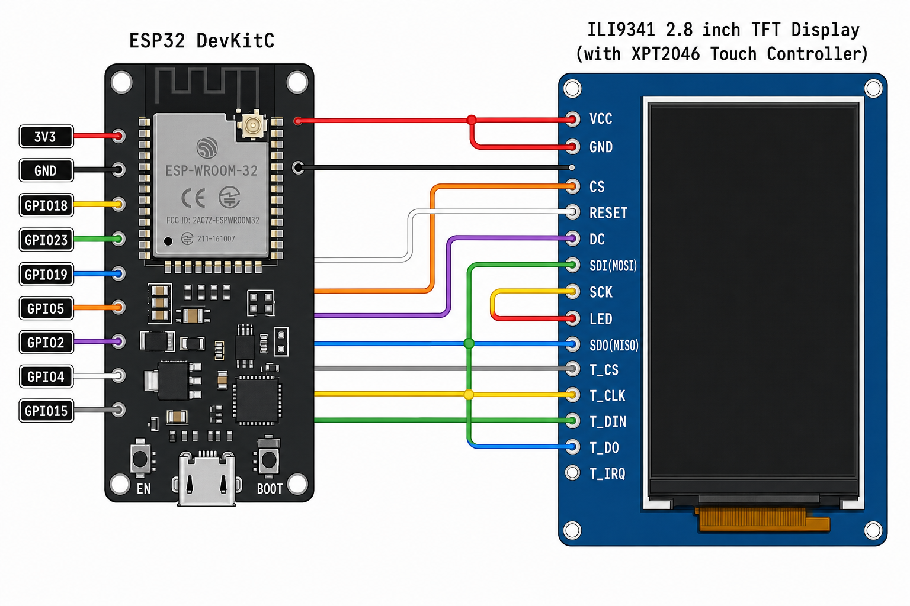
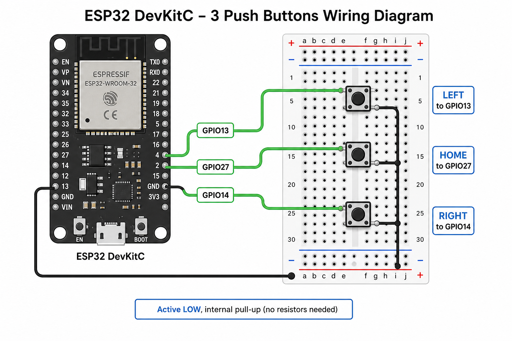

# GameBase — Custom 2D Game Engine on ESP32

A handheld-style game console built on an **ESP32** with a **240×320 ILI9341 TFT**
display and **XPT2046** resistive touch panel. The firmware runs a custom 2D game
engine (scene graph, avatar compositor, physics, audio) and ships with a
**Studio Ghibli–themed virtual pet** hub plus three mini-games, a grocery store,
and settings.

**Repository:** [github.com/fernandohar/ESP8266_ili9341](https://github.com/fernandohar/ESP8266_ili9341)

> For a polished demo/portfolio write-up, see [`NOTION.md`](NOTION.md).

---

## How it works

**Pet Totoro** is the central hub. Tap Totoro to open a **radial action menu**:

| Action | What it does |
|--------|--------------|
| **Play** | Sub-menu → Acorn Catch / Tic-Tac-Toe / Whack-a-Mole |
| **Eat** | Grocery store — buy food to feed Totoro |
| **Pet** | Boost happiness (limited sessions per minute) |
| **Bath** | Clean Totoro and gain care XP |
| **Info** | Read-only status screen (stats, growth stage, coins) |
| **Set** | Touch calibration and factory reset |

Press **Home** (button or on-screen) from any scene to return to Pet Totoro.
Progress (pet stats, coins, touch calibration) is saved to ESP32 **NVS** on every
scene change.

---

## Scenes

| Scene | What it is |
|-------|------------|
| **Pet Totoro** (hub) | Virtual pet home in a forest room. Walk Totoro by touch-drag, clean soot sprites, manage four stats (health, hunger, happiness, cleanness) that decay over time, and grow through Baby → Junior → Adult stages via care XP. |
| **Acorn Catch** | Side-view catcher: Mei vs rival Chu Totoro. Three modes — **Time Attack** (30 s + bonus time per acorn), **Survival** (3 lives, dodge soot), **Collector** (reach 30 acorns). Falling acorns speed up; soot hazards penalize score/lives. |
| **Tic-Tac-Toe** | 1P vs CPU (win/block AI with occasional fumble) or 2P hot-seat. Grass tiled board with Mei (O) and Cat Bus (X) tokens. |
| **Whack-a-Mole** | 30-second timed rounds. Tap soot-moles across **5 difficulty levels** (faster spawn/visibility). |
| **Grocery** | Paginated food shop (12 items). Purchases trigger an eating animation back in the pet home. |
| **Status** | Read-only pet stats, growth stage + XP progress, coin count. |
| **Settings** | Touch calibration and two-tap factory reset (wipes NVS pet save). |

> For contributors / AI agents: see [`AGENTS.md`](AGENTS.md) for the asset
> (sprite/background) generation pipeline and the rendering rules
> (`renderScene()` vs `renderFullScreen()`).

---

## Engine highlights

| Subsystem | Implementation |
|-----------|----------------|
| **Scene manager** | Fixed 20 Hz tick, dirty-rectangle rendering, up to 10 scenes |
| **Avatars** | PROGMEM RGB565 sprites + 1-bit opacity masks, animation, sprite sheets, attachments |
| **Backgrounds** | Full bitmap (~150 KB) or tiled repeat (~5 KB for 50×50 grass) |
| **Physics** | AABB + circle collision with impulse resolution (`Physics.h`) |
| **Input** | Resistive touch (XPT2046) + optional 3-button pad (Left / Home / Right) |
| **Audio** | Non-blocking tone queue via FreeRTOS task on ESP32 (`SoundPlayer`) |
| **Persistence** | NVS for touch calibration and pet progress (`PetSave`, `TouchCalibration`) |

---

## Build environments

This project has two PlatformIO environments. **`esp32-hw` is the default.**

| Environment    | Target                     | Touch driver                | Notes |
|----------------|----------------------------|-----------------------------|-------|
| `esp32-hw`     | **Physical board**         | XPT2046 (resistive, SPI)    | Default. `pio run` builds this. |
| `esp32-wroom`  | **Wokwi simulator**        | FT6206 (capacitive, I2C)    | Build with `-e esp32-wroom`. Calibration is compiled out. |

The two builds differ by the `-D WOKWI_CAP_TOUCH` flag (present only in
`esp32-wroom`). Never flash `esp32-wroom` to the physical board — it uses a
different touch controller and skips calibration.

---

## Flash to the physical board

The board enumerates as `/dev/cu.usbserial-0001` on macOS (yours may differ; run
`pio device list` to check).

```bash
cd GameBase

# Build + upload to the ESP32 (esp32-hw is the default env)
pio run -t upload

# Open the serial monitor (115200 baud)
pio device monitor

# Full wipe of flash + NVS (also clears saved touch calibration + pet save), then reflash
pio run -t erase
pio run -t upload
```

If upload fails with "port is busy / Resource temporarily unavailable", a serial
monitor is still holding the port — close it first (`Ctrl-C` in the monitor, or
close the monitor terminal), then upload again.

---

## Run in the Wokwi simulator

The simulator uses [`diagram.json`](diagram.json) and [`wokwi.toml`](wokwi.toml)
(which points at the `esp32-wroom` build output).

```bash
cd GameBase

# 1. Build the simulator firmware (NOT the default env)
pio run -e esp32-wroom

# 2. Start the simulator (VS Code "Wokwi: Start Simulator", or the Wokwi CLI)
```

Because `wokwi.toml` references `.pio/build/esp32-wroom/firmware.bin`, you must
build `-e esp32-wroom` before starting the simulator.

---

## Wiring — Display (ILI9341 + XPT2046)

The display and the touch controller **share the SPI clock and MOSI** (`SCK` /
`MOSI`). Only the chip-select lines differ: `CS` for the display, `T_CS` for touch.

> **⚠️ Do NOT connect the LCD's `SDO`/`MISO` pin.** `GPIO19` (MISO) is used by the
> **touch controller only** (`T_DO`). Wiring the LCD `SDO` here breaks touch — see
> the [MISO note](#miso-warning) below.



*Illustration only — the table below is the source of truth.*

| Display pin      | ESP32 GPIO | Build flag   | Wire (in image) |
|------------------|------------|--------------|-----------------|
| VCC              | 3V3        | —            | red             |
| LED (backlight)  | 3V3        | —            | red             |
| GND              | GND        | —            | black           |
| SCK              | GPIO18     | `TFT_SCLK`   | yellow (shared) |
| SDI (MOSI)       | GPIO23     | `TFT_MOSI`   | green  (shared) |
| SDO (MISO)       | **DO NOT CONNECT** | `TFT_MISO` | — (see note) |
| CS               | GPIO5      | `TFT_CS`     | orange          |
| DC               | GPIO2      | `TFT_DC`     | purple          |
| RESET            | GPIO4      | `TFT_RST`    | white           |
| T_CLK            | GPIO18     | (shared SCK) | yellow (shared) |
| T_DIN (MOSI)     | GPIO23     | (shared MOSI)| green  (shared) |
| T_DO  (MISO)     | GPIO19     | `TFT_MISO`   | blue (touch only) |
| T_CS             | GPIO15     | `TOUCH_CS`   | gray            |
| T_IRQ            | *not connected* | —       | —               |

Notes:
- <a id="miso-warning"></a>**Do NOT connect the LCD's `SDO`/`MISO` pin.** `GPIO19`
  is wired to the touch controller's `T_DO` **only**. Most ILI9341 modules do not
  tri-state the LCD `SDO` output when the LCD is deselected, so if the LCD `SDO` is
  also wired to `GPIO19` it fights the XPT2046 on every touch read: the panel still
  draws fine, but touch reads come back as garbage (low `Z`, pinned `X`/`Y`) and
  touch appears completely dead. The firmware never reads pixels back from the
  panel, so the LCD `MISO` line is not needed. **This is the #1 cause of "touch
  stopped working" after rewiring.**
- `T_IRQ` is left unconnected. Touch is polled via TFT_eSPI `getTouch()`, so the
  interrupt line is not required.
- Pin numbers live in `platformio.ini` under `[env:esp32-hw]` `build_flags`.
- If you see resets/brownouts when the backlight is on, the 3V3 rail may be
  marginal over USB — power the display from a stronger 3V3 source.

---

## Wiring — Physical buttons (optional)

Three momentary push buttons drive the menu (Left / Home / Right). They are
**active-LOW with the ESP32 internal pull-ups**, so each button just connects a
GPIO to GND — **no external resistors needed**.



| Button | ESP32 GPIO | Firmware constant (`src/Input.h`) |
|--------|------------|-----------------------------------|
| LEFT   | GPIO13     | `BTN_LEFT_PIN`                    |
| HOME   | GPIO27     | `BTN_HOME_PIN`                    |
| RIGHT  | GPIO14     | `BTN_RIGHT_PIN`                   |

Each button: one leg → the listed GPIO, the other leg → a common **GND** rail.

```
 GPIO13 ──[ LEFT  btn ]──┐
 GPIO27 ──[ HOME  btn ]──┼── GND
 GPIO14 ──[ RIGHT btn ]──┘
```

The buttons are optional for basic play (the game is touch-driven), but **Left +
Right double as a touch-calibration escape hatch** (see below), so wiring them is
recommended.

---

## Touch calibration

Calibration data (`calData[5]`) is stored in ESP32 **NVS** and survives reboots.
On the very first boot after a flash-erase (empty NVS), the firmware
automatically launches calibration. Follow the on-screen prompt and **tap each
corner arrow** as it appears.

### How to (re)enter calibration

There are four ways — you can never get locked out:

1. **Serial command (most reliable — needs neither touch nor buttons).**
   Open the serial monitor at 115200 and send **`c`** (or `C`). The device
   calibrates, saves, and reboots.
   ```bash
   pio device monitor      # then type: c  <Enter>
   ```
2. **Boot combo (hardware escape hatch).** Hold **LEFT + RIGHT** while pressing
   the board's reset/EN button. Works even when the stored calibration is
   completely wrong (calibration reads raw ADC values, not the stored mapping).
3. **Settings screen.** From the hub, open **Settings** (radial menu → Set), then
   tap the **"Calibrate Touch"** button — or press the **LEFT** button while in
   Settings.
4. **Empty NVS.** After `pio run -t erase`, the next boot auto-calibrates.

### Factory-reset the calibration

```bash
pio run -t erase     # wipes flash + NVS (clears saved calibration + pet save)
pio run -t upload    # reflash; next boot auto-calibrates
```

> Only the `esp32-hw` build has calibration. In `esp32-wroom` (Wokwi) the touch
> is capacitive and needs no calibration, so all the above is compiled out.
